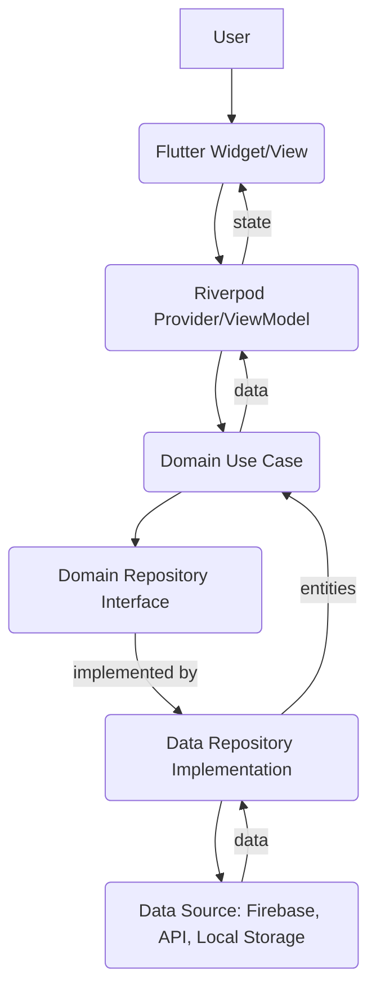
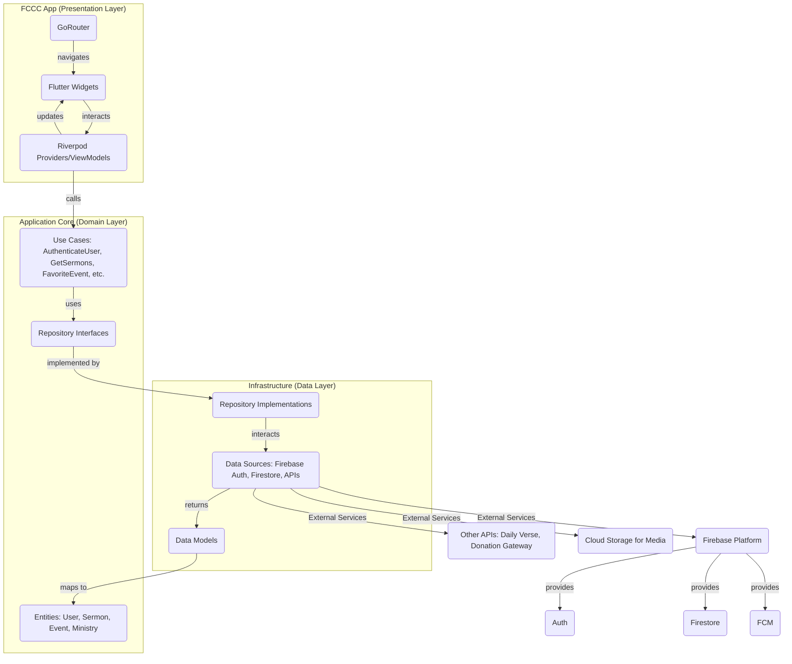

# DESIGN.md: FCCC Church Application

## 1. Overview

This document outlines the design for the "FCCC Church Application" (`fccc_app`), a mobile application built with Flutter. The app aims to provide a centralized platform for church members to access sermons, view events, manage personal preferences, and engage with ministry information. The application will be cross-platform, supporting both Android and iOS devices.

## 2. Detailed Analysis of the Goal or Problem

The primary goal is to create a comprehensive digital hub for the FCCC church, addressing the need for a unified platform to disseminate information and foster community engagement. Currently, church information might be fragmented across various channels (e.g., website, social media, WhatsApp groups), leading to potential communication gaps and difficulty for members to stay updated.

The application will solve these problems by:

*   **Centralizing Content:** Providing a single source for sermons, event calendars, and ministry details.
*   **Enhancing Engagement:** Allowing users to favorite content, receive targeted notifications, and access devotionals.
*   **Streamlining Communication:** Offering a clear channel for church announcements and information.
*   **Facilitating Giving:** Providing easy access to online donation platforms.

**Key User Stories:**

*   As a church member, I want to listen to past sermons on demand, so I can catch up on messages I missed or revisit favorites.
*   As a church member, I want to see all upcoming church events in one place, so I can plan my schedule accordingly and not miss important gatherings.
*   As a church member, I want to save my favorite events and sermons, so I can easily find them later.
*   As a church member, I want to receive notifications for events I've favorited, so I don't forget to attend.
*   As a church member, I want to view details about different ministries, so I can find opportunities to get involved.
*   As a church member, I want to easily access the church's online giving platform, so I can contribute financially.
*   As a church member, I want to receive a daily Bible verse, so I can stay spiritually encouraged.
*   As a new user, I want to easily create an account, so I can access personalized features.

## 3. Alternatives Considered

During the planning phase, various architectural patterns, state management solutions, and navigation approaches were considered.

### 3.1. Architectural Patterns

*   **MVC (Model-View-Controller) / MVVM (Model-View-ViewModel):** While common in other frameworks, Flutter's widget-based nature often lends itself better to patterns that emphasize reactive UI and clear separation of business logic from presentation. MVC/MVVM can be adapted, but may not fully leverage Flutter's strengths.
*   **BLoC (Business Logic Component):** A robust pattern for complex applications, offering strict separation and testability. However, it can introduce more boilerplate code, which might be an overhead for initial development, especially for features that are not extremely complex.
*   **Clean Architecture:** This pattern was chosen as it provides excellent separation of concerns, testability, and scalability. It naturally aligns with Flutter's component-based development and supports a maintainable codebase as the app grows.

### 3.2. State Management

*   **`setState`:** Simple for local, ephemeral state but quickly becomes unmanageable for app-wide or shared state. Not suitable for an application of this complexity.
*   **Provider:** A popular and relatively simple solution built on `InheritedWidget`. While good for medium-sized apps, its dependency injection capabilities are less powerful than Riverpod, and it can sometimes lead to issues with widget trees and rebuilds if not managed carefully.
*   **GetX:** Offers a comprehensive solution including state management, dependency injection, and routing. However, it is often criticized for its "magic" and less explicit nature, which can make debugging and understanding the code flow more challenging for some developers.
*   **Riverpod:** **Chosen.** Riverpod, being an evolution of Provider, addresses many of its shortcomings. It offers compile-time safety, explicit dependency graphs, and improved testability, making it a robust choice for scalable applications. Its provider system makes dependency injection straightforward and predictable.

### 3.3. Navigation

*   **`Navigator 1.0` (Imperative):** The traditional `Navigator.push`/`pop` approach. While simple for basic flows, it struggles with deep linking, web integration, and complex nested routes, making it less ideal for a multi-featured app with potential web aspirations.
*   **`auto_route`:** A popular declarative routing package that uses code generation. It offers strong typing and a streamlined API. However, the reliance on code generation can sometimes add complexity to the build process and increase build times.
*   **`go_router`:** **Chosen.** `go_router` is the recommended declarative navigation package by the Flutter team. It provides robust support for deep linking, web navigation, and managing complex navigation states without requiring extensive code generation for basic routes. It is also actively maintained and benefits from official Flutter support.

## 4. Detailed Design for the FCCC Church Application

### 4.1. Core Principles

*   **Modularity:** The application will be divided into independent modules (e.g., sermons, events, authentication) to promote reusability and maintainability.
*   **Scalability:** The architecture and chosen technologies are designed to accommodate future features and growing user bases.
*   **Testability:** Each layer and component will be designed with unit and widget testing in mind.
*   **User-Centric Design:** The UI/UX will prioritize ease of use, accessibility, and a clean aesthetic.

### 4.2. High-Level Architecture (Clean Architecture)

The application will adhere to the principles of Clean Architecture, organizing the codebase into distinct, concentric layers. This promotes separation of concerns, testability, and makes the application independent of external frameworks or databases.

#### Layers:

1.  **Presentation Layer (Flutter UI, Widgets, ViewModels/Providers):**
    *   **Widgets:** The visual components of the application.
    *   **Views:** UI screens responsible for displaying data and handling user input.
    *   **ViewModels (using Riverpod Providers):** Act as intermediaries between Views and Use Cases. They hold the UI state, expose data to the Views, and respond to user interactions by triggering Use Cases.
    *   This layer will depend only on the Domain Layer.

2.  **Domain Layer (Entities, Use Cases, Repositories Interfaces):**
    *   **Entities:** Core business objects (e.g., `User`, `Sermon`, `Event`, `Ministry`). These are pure Dart objects with no external dependencies.
    *   **Use Cases (Interactors):** Encapsulate specific business rules and operations. They orchestrate the flow of data to and from the repositories. (e.g., `GetSermonsUseCase`, `AuthenticateUserUseCase`). They depend on Repository Interfaces.
    *   **Repository Interfaces:** Abstract definitions of how data is fetched or stored. These are defined in the Domain Layer but implemented in the Data Layer.
    *   This layer has no dependencies on other layers.

3.  **Data Layer (Repositories Implementations, Data Sources, Models):**
    *   **Repository Implementations:** Concrete implementations of the Repository Interfaces defined in the Domain Layer. They manage interactions with one or more Data Sources. (e.g., `SermonRepositoryImpl`).
    *   **Data Sources:** Handle interactions with external services or local storage (e.g., `FirebaseSermonDataSource`, `AuthDataSource`).
    *   **Models:** Data structures used for serialization/deserialization with external data sources (e.g., Firestore documents to `SermonModel`). These are then mapped to Domain Entities.
    *   This layer depends on external frameworks (Firebase) and maps external data to Domain Entities. It depends on the Domain Layer (for entities and interfaces).

#### Data Flow:



### 4.3. Feature-Specific Design

#### 4.3.1. Authentication & User Management

*   **Technology:** Firebase Authentication for user accounts (email/password, potentially Google Sign-in in the future). Firestore for storing user profiles and personalized data (favorite sermons/events, prayer requests).
*   **Flow:**
    1.  User registers/logs in via `FirebaseAuth`.
    2.  Upon successful login, `FirebaseAuth.instance.authStateChanges()` stream notifies the app.
    3.  User data (`uid`, `email`, `displayName`) is retrieved from `FirebaseAuth.currentUser` and stored/updated in a `users` collection in Firestore.
    4.  User-specific data (favorites, prayer requests) are managed within the user's document in Firestore.

#### 4.3.2. Sermons

*   **Technology:** Firestore for sermon metadata. `just_audio` for audio playback, `video_player` (with `chewie` or `flick_video_player` for custom controls) for video playback.
*   **Data Structure (Firestore `sermons` collection):**
    *   `id`: String (Document ID)
    *   `title`: String
    *   `description`: String
    *   `preacher`: String
    *   `date`: Timestamp
    *   `audioUrl`: String (URL to audio file)
    *   `videoUrl`: String (Optional, URL to video file)
    *   `transcriptUrl`: String (Optional, URL to text transcript)
    *   `duration`: String (e.g., "30:45")
    *   `thumbnailUrl`: String (Optional)
*   **Functionality:**
    *   Display a list of sermons with titles, preachers, dates, and thumbnails.
    *   Allow streaming and downloading of audio.
    *   Provide a dedicated player screen for audio/video with playback controls (play/pause, seek, volume).
    *   Users can mark sermons as favorites, stored in their Firestore user profile.

#### 4.3.3. Calendar & Events

*   **Technology:** Firestore for event data. `table_calendar` for the calendar UI.
*   **Data Structure (Firestore `events` collection):**
    *   `id`: String (Document ID)
    *   `title`: String
    *   `description`: String
    *   `date`: Timestamp (Date and time of the event)
    *   `location`: String
    *   `ministry`: String (e.g., "Youth", "Worship", "Men's")
    *   `imageUrl`: String (Optional)
*   **Functionality:**
    *   Display a monthly calendar view highlighting days with events.
    *   Tap on a day to view a list of events for that day.
    *   Tap on an event to view detailed information.
    *   Users can mark events as favorites, stored in their Firestore user profile.
    *   Future: Implement RSVP functionality (requires user interaction with Firestore).

#### 4.3.4. Ministry Directory

*   **Technology:** Firestore for ministry data.
*   **Data Structure (Firestore `ministries` collection):**
    *   `id`: String (Document ID)
    *   `name`: String
    *   `leader`: String
    *   `mission`: String
    *   `vision`: String
    *   `contactPhone`: String
    *   `contactEmail`: String
    *   `scheduledEvents`: `List<String>` (IDs of related events)
    *   `description`: String
    *   `imageUrl`: String (Optional)
*   **Functionality:**
    *   Display a list of ministries.
    *   Tap on a ministry to view detailed information (leader, mission, vision, contact, scheduled events).

#### 4.3.5. Donations

*   **Technology:** `url_launcher` package to open external URLs.
*   **Functionality:** A dedicated button/section that opens the provided external URL for online tithes and donations in the device's default browser.

#### 4.3.6. Push Notifications

*   **Technology:** Firebase Cloud Messaging (FCM) combined with `flutter_local_notifications` for foreground notifications.
*   **Functionality:**
    *   Reminders for favorited events (scheduled via FCM or locally).
    *   Daily Bible verse notifications (scheduled via FCM or locally, fetching from an API or local asset).
    *   Future: General church announcements via FCM.

#### 4.3.7. Daily Verse/Devotionals

*   **Technology:** API for daily Bible verses (e.g., from Bible APIs). `flutter_local_notifications` for display.
*   **Functionality:**
    *   A scheduled daily notification presenting a Bible verse.
    *   Future: Integrate with an API for daily devotionals or store them locally.

### 4.4. Navigation Design (GoRouter)

`go_router` will be used for declarative routing. The routes will be defined in a central `router.dart` file.

```mermaid
graph TD
    A[Splash Screen] --> B{Authentication State}
    B -- Logged In --> C[Home Screen]
    B -- Not Logged In --> D[Login/Register Screen]

    C --> C1[Sermons List]
    C1 --> C1a[Sermon Detail/Player]
    C --> C2[Events Calendar/List]
    C2 --> C2a[Event Detail]
    C --> C3[Ministry Directory]
    C3 --> C3a[Ministry Detail]
    C --> C4[Profile Screen]
    C --> C5[Donations (External Link)]
```

### 4.5. Mermaid Diagram of Overall Architecture



## 5. Summary

The FCCC Church Application will be a comprehensive Flutter mobile app leveraging Clean Architecture for a modular, scalable, and testable codebase. Riverpod will manage state, and GoRouter will handle navigation. Firebase will serve as the backend for authentication, database (Firestore for data storage), and push notifications (FCM). Media playback will use `just_audio` and `video_player`, while `table_calendar` will power the event display. The UI will prioritize a clean, intuitive, and consistent user experience.

## 6. References

*   **Flutter Architecture & State Management:**
    *   [Flutter.dev - Architectural overview](https://flutter.dev/docs/data-and-backend/architectural-overview)
    *   [Riverpod Documentation](https://riverpod.dev/)
    *   [Clean Architecture for Flutter (Medium)](https://medium.com/@riyazhussain_72288/clean-architecture-for-flutter-a-comprehensive-guide-a279c6130ac0)
*   **Media Playback:**
    *   [pub.dev - just_audio](https://pub.dev/packages/just_audio)
    *   [pub.dev - video_player](https://pub.dev/packages/video_player)
    *   [Flutter.dev - Video player tutorial](https://flutter.dev/docs/cookbook/plugins/play-video)
*   **Calendar & Events:**
    *   [pub.dev - table_calendar](https://pub.dev/packages/table_calendar)
*   **Authentication & Messaging:**
    *   [Firebase for Flutter](https://firebase.flutter.dev/)
    *   [Firebase Auth Documentation](https://firebase.google.com/docs/auth/flutter/start)
    *   [Firebase Cloud Messaging Documentation](https://firebase.google.com/docs/cloud-messaging/flutter/client)
    *   [pub.dev - flutter_local_notifications](https://pub.dev/packages/flutter_local_notifications)
*   **Navigation:**
    *   [pub.dev - go_router](https://pub.dev/packages/go_router)
    *   [Flutter.dev - Navigation and routing](https://flutter.dev/docs/development/ui/navigation)
*   **UI/UX Guidelines:**
    *   [Material Design Guidelines](https://material.io/design)
    *   [Flutter.dev - Accessibility](https://flutter.dev/docs/development/accessibility-and-localization/accessibility)
